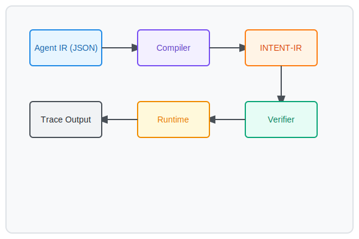

# INTENT-IR
**A Deterministic Execution Substrate for AI Agents.**

Modern AI agents typically operate by emitting unstructured text or calling opaque APIs, making their actions difficult to audit, verify, or replay. **INTENT-IR** introduces a research-level intermediate representation (IR) and runtime that treats agent actions as first-class instructions. By lowering agentic intent to a structured ISA, we enable static safety checks, deterministic execution, and high-fidelity trace/replay functionality—bringing the rigor of systems engineering to agentic workflows.

---

## Why this exists

### The Problem: Abstraction Leakage & Opacity
Current agentic workflows suffer from a lack of formal boundaries. When an agent calls a tool, the reasoning logic and the execution side-effects are tightly coupled. This makes it impossible to:
1. **Verify safety** before execution (e.g., will this agent exceed its token budget?).
2. **Reproduce failures** exactly (LLM outputs are non-deterministic).
3. **Inspect intent** without parsing ambiguous logs.

### The Solution: Structured Execution
INTENT-IR provides a formal instruction set for the reasoning engine. Instead of "doing" things, the agent "emits" intent. This intent is:
- **Compiled**: Lowered from high-level goals to discrete instructions.
- **Verified**: Checked against resource bounds and safety constraints (WASM/eBPF model).
- **Traced**: Every state transition is recorded for bit-perfect replay.

---

## Opaque APIs vs. INTENT-IR

| Dimension | Opaque APIs / Tool-Calling | INTENT-IR |
| :--- | :--- | :--- |
| **Inspectability** | Black-box (logs only) | White-box (instruction-level) |
| **Determinism** | Non-deterministic / Flaky | Bit-perfect replay |
| **Replayability** | Manual / Scripted | Native, trace-first model |
| **Validation** | Runtime errors | Static verification (eBPF-style) |
| **Composability** | High-level / Brittle | Low-level / Orthogonal ISA |
| **Debugging** | Log-parsing | Instruction-stepping |

---

## Quickstart

### Installation
```bash
make install
```

### Running a Demo
```bash
make demo
```

### Manual Usage
```bash
# Compile Agent IR (JSON) to INTENT-IR
intentir compile examples/repo_scan/task.json -o build/repo_scan.ir

# Assemble to Binary
intentir asm build/repo_scan.ir -o build/repo_scan.bin

# Run with Tracing
intentir run build/repo_scan.ir --trace traces/repo_scan.trace.jsonl

# Replay Trace
intentir replay traces/repo_scan.trace.jsonl
```

---

## Instruction Set Architecture (ISA)

INTENT-IR instructions are designed for the "Agent-Native" era:

- `DECLARE_AGENT`: Identity and capability declaration.
- `ALLOC_BUDGET`: Token and compute resource allocation.
- `CALL_TOOL`: Structured interface for external interaction.
- `ASSERT`: Verifiable state checks within the execution flow.
- `COMMIT`: Immutable recording of agent outputs.

---

## Architecture Pipeline



1. **LLM** emits Agent IR (JSON).
2. **Compiler** lowers JSON to INTENT-IR instructions.
3. **Verifier** ensures the IR is safe and budgeted.
4. **Runtime** executes instructions and generates a `.trace` file.
5. **Human Auditor** inspects the trace via `intentir replay`.

---

## Comparison vs API-calling Agents

| Feature | API Agents | INTENT-IR Agents |
|---------|------------|------------------|
| Intent | Opaque Text | Structured IR |
| Verification | Post-hoc | Pre-execution |
| Replay | Impossible/Flaky | Deterministic |
| Budgeting | Soft-limits | Hard-enforcement |
| Inspectability | Log-based | Instruction-level |

---

## License
MIT
